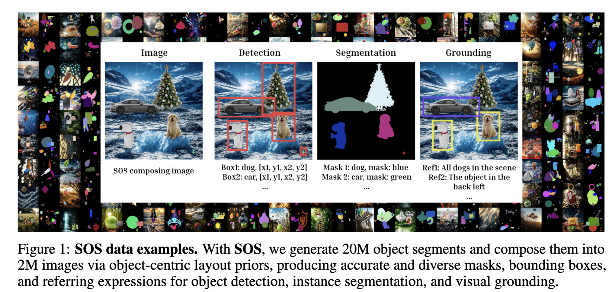

<h1 align="center">
  SOS: Synthetic Object Segments Improve Detection, Segmentation, and Grounding
</h1>

<h2 align="center">
  <!-- <a href="https://generate-any-scene.github.io/">🌐 Website</a> | -->
  <!-- <a href="https://arxiv.org/abs/2412.08221">📑 Paper</a> | -->
  <a href="https://huggingface.co/collections/weikaih/sos-synthetic-object-segments-improves-detection-segmentat-682679751d20faa20800033c">🤗  Dataset</a>
</h2>

<small>
  Weikai Huang1, Jieyu Zhang1,
  Taoyang Jia1, Chenhao Zheng1, Ziqi Gao1,
  Jae Sung Park1, Ranjay Krishna1,2 
  1&nbsp University of Washington &nbsp 
  2Allen Institute for AI
</small>

  

A scalable pipeline for composing high-quality synthetic object segments into richly annotated images for object detection, instance segmentation, and visual grounding.

# Installation

# Method

  

  

# Results

## Task 1: Open-Vocabulary Object Detection

  

- **Small amount of SOS efficiently brings strong gain.**  
  With only 50 K synthetic images, SOS boosts LVIS AP from 20.1 → 29.8 (+ 9.7) and APrare from 10.1 → 23.5 (+ 13.4) 

- **Scaling up SOS data leads to better performance.**  
  Doubling to 100 K yields AP 31.0 (+ 1.2) and further scaling to 400 K yields AP 31.4 (+ 1.6) on LVIS and OdinW-35 mAP 22.8 (+ 1.8)  

- **SOS is complementary to real datasets.**  
  Mixing 100 K SOS with COCO + GRIT + V3Det raises LVIS AP from 31.9 → 33.2 (+ 1.3) and APrare from 23.6 → 29.8 (+ 6.2) 

## Task 2: Visual Grounding

  

- **Existing large detection and grounding datasets yield only marginal improvements.**  
  Adding V3Det or 20 M GRIT examples to Object365 + GoldG brings at most + 0.5 P@1 on gRefCOCO and + 1.4 mAP on DoD (FULL) 

- **SOS provides diverse, high-quality referring expressions that yield strong gains.**  
  SOS-50K improves gRefCOCO no-target accuracy by + 4.6 (89.3 → 93.9) and DoD (FULL) mAP by + 1.0; scaling to SOS-100K further adds + 8.4 no-target accuracy and + 3.8 mAP 

## Task 3: Instance Segmentation

  

- **SOS continuously improves LVIS segmentation.**  
  Fine-tuning APE on 50 K SOS then LVIS raises APrare from 40.87 → 44.70 (+ 3.83), overall AP from 46.96 → 48.48 (+ 1.52), and APfrequent by + 0.31

## Task 4: Small-Vocabulary, Limited-Data Regimes
- **SOS excels in low-data regimes.**  
  Augmenting 1% of COCO with SOS yields a + 6.59 AP gain; this boost grows by ~ 3 points at 10%, 50%, and 100% COCO scales  

## Task 5: Intra-Class Referring Expression

  

- **Targeted SOS data fixes intra-class shortcuts.**  
  Fine-tuning on 100 K SOS-SFC + SOS-SGC raises Average Gap by + 3.1 (37.5 → 40.6) and boosts Positive Gap Ratio to 90%  

### Ablation Study
- **Layout choice matters.**  
  Our layout (AP 9.16) outperforms random (9.07) and COCO-based (8.60).  

- **Relighting & blending are critical.**  
  Adding relighting & blending yields a + 39.7 % AP uplift (9.16 → 12.79).  

- **Segment quality impacts results.**  
  Real segments alone AP 7.03 → + Subject200K 12.06 → + SOS 12.79.  

<!-- *For figures, tables, and full details see the [paper PDF](./paper.pdf) and supplementary materials.*   -->

# Contact
* Weikai Huang: weikaih@cs.washington.edu
* Jieyu Zhang: jieyuz2@cs.washingtong.edu

# Citation
Bibtex: stay tuned for Arxiv!